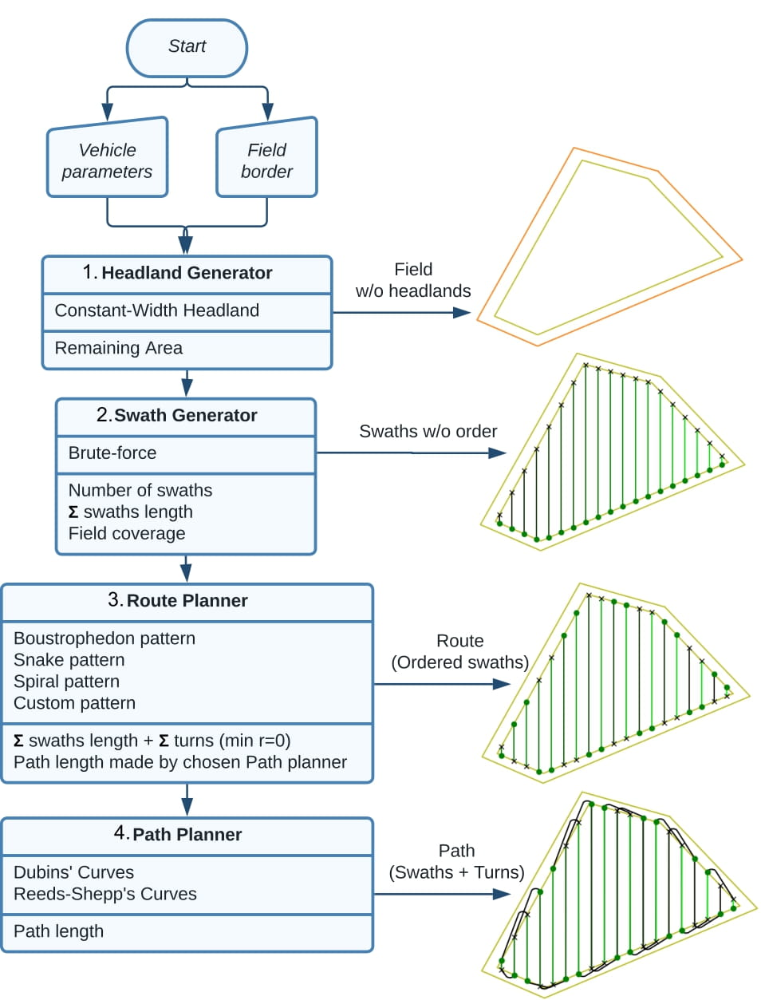
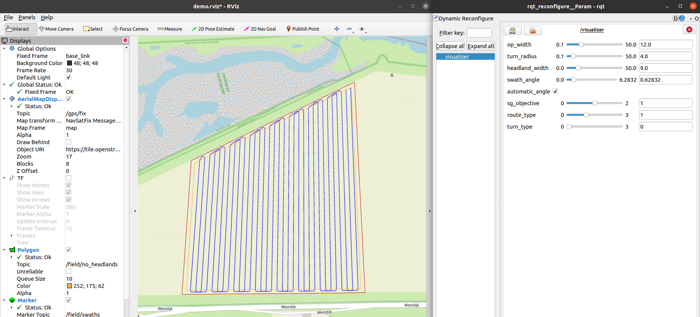

Fields2Cover
============

  **Robust and efficient coverage paths for autonomous agricultural vehicles**

|Open in GitHub Codespaces|

|DOI| |build| |CODECOV| |license| |Language-C++| |Language-Python| |stars| |forks|

`The extended documentation is here <https://fields2cover.github.io/>`__.

The coverage path planning problem (CPP) aims to create a path to cover an area with one or several vehicles.
CPP has many application as cleaning robots, surveillance, de-mining or agriculture.
Each of the application has its own requirements.
For example, in cleaning robots environment is usually unknown and the objective is improve the probability of cover the area.
On the other hand, CPP in agriculture knows the area to cover, but the coverage has to be complete.

Fields2Cover library provides several algorithms to plan the coverage path on convex fields:

Although the development of this project is focused on offline planning of agricultural vehicles, the library accepts pull requests from other types of coverage planners.

Citing
-------

Please cite the  following paper (https://ieeexplore.ieee.org/document/10050562) when using Fields2Cover for your research:

.. code-block:: bibtex

  @article{Mier_Fields2Cover_An_open-source_2023,
    author={Mier, Gonzalo and Valente, João and de Bruin, Sytze},
    journal={IEEE Robotics and Automation Letters},
    title={Fields2Cover: An Open-Source Coverage Path Planning Library for Unmanned Agricultural Vehicles},
    year={2023},
    volume={8},
    number={4},
    pages={2166-2172},
    doi={10.1109/LRA.2023.3248439}
  }

Why?
-----

There are many CPP papers out there, but almost no code about their implementation.
Due to this, research about this topic is slow as you need to implement every algorithm you want to compare with.

Fields2Cover provides a flexible structure and several algorithms to compare with, so any developer can research about this topic easily.

Installation
------------

The Fields2Cover package has only been tested on Ubuntu 18.04, 20.04 and 22.04.
If you are able to run it in other operative systems, open an issue/PR and it will be added to this guide

Requirements on Linux
^^^^^^^^^^^^^^^^^^^^^^

Some packages are needed before compiling the package:

  ``📝`` If your OS is Ubuntu 18.04 or 20.04, you would need to do ``sudo add-apt-repository ppa:ubuntugis/ppa``

.. code-block:: console

   sudo apt-get update
   sudo apt-get install --no-install-recommends software-properties-common
   sudo add-apt-repository ppa:ubuntugis/ppa
   sudo apt-get update
   sudo apt-get install --no-install-recommends build-essential ca-certificates cmake \
        doxygen g++ git libeigen3-dev libgdal-dev libpython3-dev python3 python3-pip \
        python3-matplotlib python3-tk lcov libgtest-dev libtbb-dev swig libgeos-dev
   python3 -m pip install gcovr

Compilation
^^^^^^^^^^^^

First, clone this repository.
Then, from the main folder of the project:

.. code-block:: console

   mkdir -p build;
   cd build;
   cmake -DCMAKE_BUILD_TYPE=Release ..;
   make -j$(nproc);

Finally, you can install it as:

.. code-block:: console

   sudo make install;

Add it to your projects
^^^^^^^^^^^^^^^^^^^^^^^^

To add Fields2Cover into your CMakeLists.txt, it is as easy as:

.. code-block:: console

   find_package(Fields2Cover REQUIRED)
   target_link_libraries(<<<your_package>>> Fields2Cover)

Compilation with python interface
^^^^^^^^^^^^^^^^^^^^^^^^^^^^^^^^^

As without the interface, clone this repository.

Install the packages required as:

.. code-block:: console

   sudo apt install swig python3-pytest

Then, from the main folder of the project:

.. code-block:: console

   cd build;
   cmake -DBUILD_PYTHON=ON ..;
   make -j$(nproc);
   sudo make install;

To test if the compilation and installation of the python interface is correct, run on python:

.. code-block:: python

  import fields2cover

Or run on the main folder:

.. code-block:: console

  pytest-3 tests/python/

ROS Compatibility
-----------------

We also provide a `ROS interface <https://github.com/Fields2Cover/fields2cover_ros>`__ with ROS 1 and ROS 2. On it, you can have a nice visualization of your field and the paths generated:

For being able to use the package from ROS, from `catkin_ws/`:

.. code-block:: console

  git clone https://github.com/Fields2Cover/Fields2Cover src/fields2cover
  git clone https://github.com/Fields2Cover/fields2cover_ros src/fields2cover_ros
  rosdep install -r --ignore-src --from-paths .
  # Compile it with ROS 1
  catkin_make_isolated
  # Compile it with ROS 2
  colcon build

Stability
---------

Fields2Cover is still in early development, so feedback and bug reports are appreciated.  At the moment, it should expected that breaking changes may be introduced as new functionality is added, bugs are fixed, and APIs are streamlined.

Contribute
-----------

If you find any issue/bug/proposal, open an issue and we will try to solve/discuss it.

Pull requests are more than welcome. For major changes, please open an issue first to discuss what you would like to change. Please make sure to update tests as appropriate.

Contributions can be easily made using |Open in GitHub Codespaces|

License
--------

Fields2Cover project is under `BSD-3 license <https://tldrlegal.com/license/bsd-3-clause-license-%28revised%29>`__.

TODO
-------

- Create SWIG interface with Lua/R
- Support Route planners with metaheuristics
- Support non-convex fields
- Consider the start and end point of the vehicle
- ...

Credits and more info
----------

This library is only possible thanks to `GDAL <https://gdal.org/index.html>`_ who provides the basic types of this library.
Other great libraries that made Fields2Cover possible are `hbanzhaf/steering_functions <https://github.com/hbanzhaf/steering_functions>`_, `nlohmann/json <https://github.com/nlohmann/json/>`_, `leethomason/tinyxml2 <https://github.com/leethomason/tinyxml2>`_, `ttk592/spline <https://github.com/ttk592/spline>`_ and `lava/matplotlib-cpp <https://github.com/lava/matplotlib-cpp>`_

This code repository is part of the project Fields2Cover which is (partly) financed by the Dutch Research Council (NWO).

.. |build| image:: https://github.com/Fields2Cover/Fields2Cover/actions/workflows/build.yml/badge.svg?branch=main
.. |stars| image:: https://img.shields.io/github/stars/fields2cover/fields2cover?style=social
.. |forks| image:: https://img.shields.io/github/forks/fields2cover/fields2cover?style=social
.. |license| image:: https://img.shields.io/badge/license-BDS3-orange.svg
   :target: https://github.com/Fields2Cover/Fields2Cover/blob/main/LICENSE
.. |Language-C++| image:: https://img.shields.io/badge/language-C++-blue.svg
   :target: https://isocpp.org/
.. |Language-Python| image:: https://img.shields.io/badge/language-Python-blue.svg
   :target: https://www.python.org/
.. |Open in GitHub Codespaces| image:: https://github.com/codespaces/badge.svg
   :target: https://github.com/codespaces/new?hide_repo_select=true&ref=main&repo=501080115
.. |DOI| image:: https://zenodo.org/badge/DOI/10.1109/LRA.2023.3248439.svg
   :target: https://doi.org/10.1109/LRA.2023.3248439

.. |CODECOV| image:: https://coveralls.io/repos/github/Fields2Cover/Fields2Cover/badge.svg?branch=main
   :target: https://coveralls.io/github/Fields2Cover/Fields2Cover?branch=main

