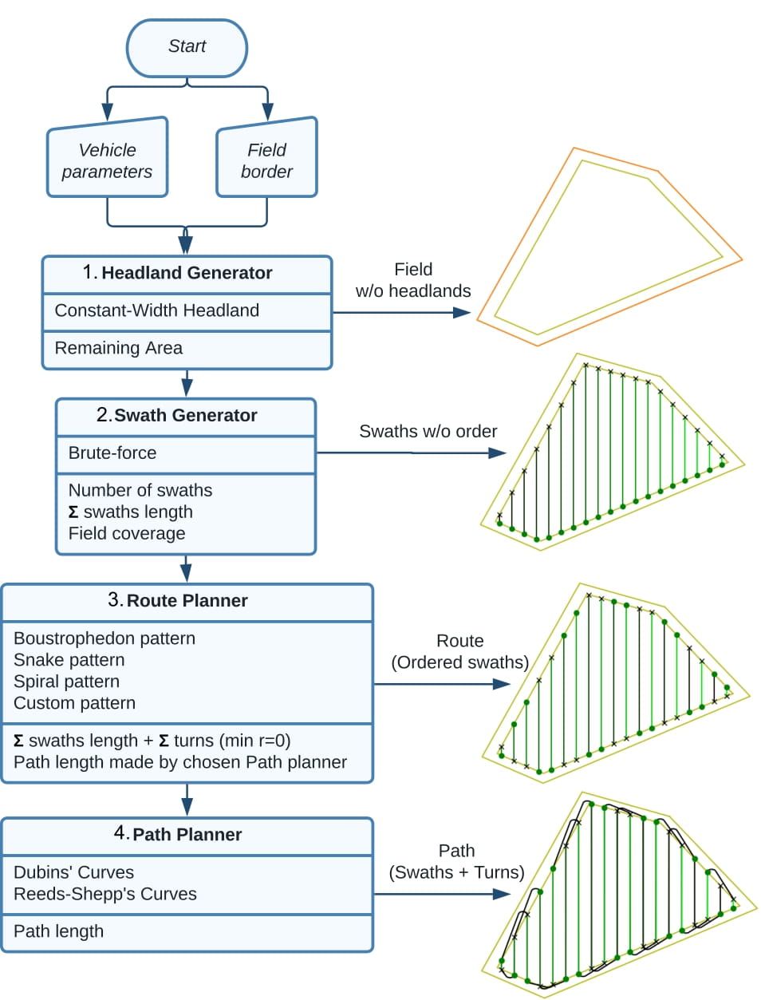

============
Fields2Cover
============

  **Robust and efficient coverage paths for autonomous agricultural vehicles**

Fields2Cover is an open-source C++ library with Python bindings that solves
the Coverage Path Planning problem for agriculture: given a field and a
vehicle, it computes a complete coverage path — headlands, swaths, an
optimized route, and a drivable path with feasible turns.

It also provides a common, extensible framework to implement and compare
coverage path planning algorithms: there are many papers on the topic, but
almost no code, so anyone researching it has to re-implement every algorithm
they want to compare against. Fields2Cover splits the problem into modules,
each solving one part of it, so algorithms can be combined, replaced and
benchmarked against each other:

Although the development of this project is focused on offline planning of
agricultural vehicles, the library accepts pull requests from other types of
coverage planners.

The source code is hosted on `GitHub <https://github.com/Fields2Cover/Fields2Cover>`__.

New here? Start with the :doc:`installation guide <source/installation>` and
the :doc:`Quick Start <source/quick_start>`, then work through the
:doc:`tutorials <source/tutorials>`.

.. toctree::
   :hidden:

   self

.. toctree::
   :caption: Getting Started
   :maxdepth: 2
   :hidden:

   source/installation.rst
   source/quick_start.rst

.. toctree::
   :maxdepth: 2
   :hidden:

   source/tutorials.rst

.. toctree::
   :maxdepth: 1
   :hidden:

   source/faq.rst

.. toctree::
   :caption: Reference
   :maxdepth: 1
   :hidden:

   api/f2c_library.rst

.. toctree::
   :caption: Migration
   :maxdepth: 1
   :hidden:

   source/migration_to_v2.rst

Contribute
==========

If you find any issue/bug/proposal, `open an issue
<https://github.com/Fields2Cover/Fields2Cover/issues>`__ and we will try to
solve/discuss it. Pull requests are more than welcome. For major changes,
please open an issue first to discuss what you would like to change. Please
make sure to update tests as appropriate.

Citing
======

Please cite `this paper <https://ieeexplore.ieee.org/document/10050562>`__
when using Fields2Cover for your research:

.. code-block:: bibtex

  @article{Mier_Fields2Cover_An_open-source_2023,
    author={Mier, Gonzalo and Valente, João and de Bruin, Sytze},
    journal={IEEE Robotics and Automation Letters},
    title={Fields2Cover: An Open-Source Coverage Path Planning Library for Unmanned Agricultural Vehicles},
    year={2023},
    volume={8},
    number={4},
    pages={2166-2172},
    doi={10.1109/LRA.2023.3248439}
  }

License
=======

Fields2Cover is released under the `BSD-3 license
<https://github.com/Fields2Cover/Fields2Cover/blob/main/LICENSE>`__.
