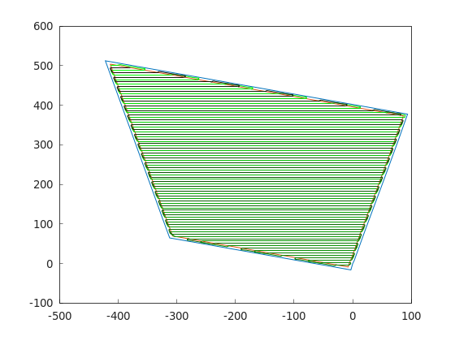

Quick Start
===========

This page takes you from an installed library to a complete coverage path in
a few lines. If you haven't installed Fields2Cover yet, start with the
:doc:`installation guide <installation>`.

The high-level functions ``planCovRoute`` and ``planCovPath`` run the whole
pipeline — headland generation, swath generation, route planning and path
planning — with sensible defaults. The :doc:`tutorials <tutorials>` show how
to run each module separately and swap the algorithms.

The example field ``test1.xml`` is in the `data folder
<https://github.com/Fields2Cover/Fields2Cover/tree/main/data>`__ of the
repository.

.. tabs:: lang

    .. code-tab:: cpp
        :caption: C++

        #include "fields2cover.h"

        int main() {
          F2CField field = f2c::Parser::importFieldGml("data/test1.xml");
          F2CRobot robot(2.0, 6.0, 0.5, 0.2);

          F2CPath path = f2c::planCovPath(robot, field, false);

          f2c::Visualizer::figure();
          f2c::Visualizer::plot(field.getCellsAbsPosition());
          f2c::Visualizer::plot(path);
          f2c::Visualizer::show();
          return 0;
        }

    .. code-tab:: python
        :caption: Python

        import fields2cover as f2c

        field = f2c.Parser().importFieldGml("data/test1.xml")
        robot = f2c.Robot(2.0, 6.0, 0.5, 0.2)

        path = f2c.planCovPath(robot, field, False)

        f2c.Visualizer.figure()
        f2c.Visualizer.plot(field.getCellsAbsPosition())
        f2c.Visualizer.plot(path)
        f2c.Visualizer.show()

The ``F2CRobot`` here is 2 m wide and covers a 6 m wide swath, with a maximum
curvature of 0.5 m⁻¹ and a maximum curvature change of 0.2 m⁻². The result is
a path that covers the whole field:

To compile the C++ example, link against Fields2Cover in your
``CMakeLists.txt``:

.. code-block:: cmake

   find_package(Fields2Cover REQUIRED)
   target_link_libraries(<your_target> Fields2Cover)
