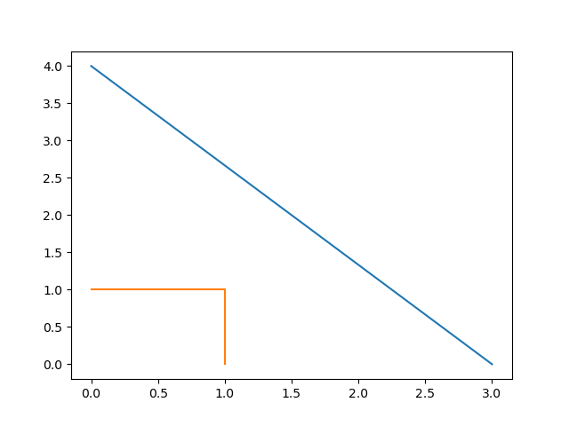

Part 1: Basic types
===================

All the tutorials assume Fields2Cover library and iostream are included as:

.. code-block:: cpp

   #include "fields2cover.h"
   #include <iostream>

Initialize a F2CPoint
---------------------

Points are the most basic type. There are many ways to initialize a ``F2CPoint`` (``f2c::types::Point``)

1. With x and y axis on the constructor

   .. code-block:: cpp

      F2CPoint p1 (1.2, 3.4);
      std::cout << "Point 1: " << p1 << std::endl;

   *Point 1: Point(1.2, 3.4, 0)*

2. With x, y and z axis on the constructor

   .. code-block:: cpp

      F2CPoint p2 (9.8, 7.6, 5.4);
      std::cout << "Point 2: " << p2 << std::endl;

   *Point 2: Point(9.8, 7.6, 5.4)*

3. Using ``OGRPoint`` from GDAL

   .. code-block:: cpp

      F2CPoint p3 (OGRPoint(11, 22));
      std::cout << "Point 3: " << p3 << std::endl;

   *Point 3: Point(11, 22, 0)*

4. Creating an empty ``F2CPoint`` and setting its components using ``setX``/``setY``/``setZ``.
   The components can be also read with ``getX``/``getY``/``getZ``.

   .. code-block:: cpp

      F2CPoint p4;
      p4.setX(3.0);
      p4.setZ(-1.0);
      std::cout << "Point 4: " << p4;
      std::cout << ". Its components are: {x: " << p4.getX();
      std::cout << ", y: " << p4.getY();
      std::cout << ", z: " << p4.getZ() << "}\n";

   *Point 4: Point(3, 0, -1). Its components are: {x: 3, y: 0, z: -1}*

5. Creating an empty ``F2CPoint`` and importing its components.

   .. code-block:: cpp

      F2CPoint p5;
      p5.importFromWkt("POINT (0 4 4)");
      std::cout << "Point 5: " << p5 << std::endl;

   *Point 5: Point(0, 4, 4)*

Basic types are shared pointers
-------------------------------

Classes derived from GDAL types, like ``F2CPoint`` from ``OGRPoint``,
use a compound structure of shared pointers on it.

The pointers to GDAL types can be access as ``p1->()`` or ``p1.get()``.
Usually, this is not needed, as a simple access has been provided:

.. code-block:: cpp

   std::cout << "Access to OGRPoints: " << p4->Distance(p5.get()) << std::endl;
   std::cout << "Without accessing: " << p4.Distance(p5) << std::endl;

| *Access to OGRPoints: 5*
| *Without accessing: 5*

One of the effects of using shared pointers in the classes is the difference between copying and cloning.

When a class is cloned, the value of the shared pointer is copied to another shared pointer with different direction.
Due to this, changing the value of the shared pointer after cloning it do not affect the cloned value:

.. code-block:: cpp

   F2CPoint old_p (1, 2);
   F2CPoint cloned_p = old_p.clone();
   std::cout << "The old point is " << old_p << std::endl;
   cloned_p *= 5.0;
   std::cout << "Old point is: " << old_p <<
      " and cloned point is: " << cloned_p << std::endl;

| *The old point is Point(1, 2, 0)*
| *Old point is: Point(1, 2, 0) and cloned point is: Point(5, 10, 0)*

On the other hand, if the shared pointer is copied, you are copying the direction of the pointer.
If one of the values is modified, the other value is modified as well:

.. code-block:: cpp

   F2CPoint copy_p = old_p;
   copy_p *= 5.5;
   std::cout << "Old point is: " << old_p <<
      " and copied point is: " << copy_p << std::endl;

*Old point is: Point(5.5, 11, 0) and copied point is: Point(5.5, 11, 0)*

.. warning::
   Despite the effect of the shared pointers on basic types is on purpouse,
   it can lead on many bugs. As developer, be aware of this effect.

Initialize a F2CLineString
--------------------------

A ``F2CLineString`` (``f2c::types::LineString``) represents a line. The ways to initialize a ``F2CLineString`` are:

1. Creating an empty ``F2CLineString`` and adding several ``F2CPoint``:

   .. code-block:: cpp

      F2CLineString line1;
      line1.addPoint(3, 0);
      line1.addPoint(p5);  // Point(0, 4)
      std::cout << "Length of line 1: " << line1.getLength() << std::endl;

   *Length of line 1: 5*

2. Creating an empty ``F2CLineString`` and adding several ``F2CPoint``:

   .. code-block:: cpp

      F2CLineString line2({F2CPoint(1, 0), F2CPoint(1, 1), F2CPoint(0, 1)});
      std::cout << "Length of line 2: " << line2.getLength() << std::endl;

   *Length of line 2: 2*

Initialize a F2CLinearRing
--------------------------

A ``F2CLinearRing`` (``f2c::types::LinearRing``) is a closed ``F2CLineString``.
It can be initialized as a ``F2CLineString``:

   .. code-block:: cpp

      F2CLinearRing ring{F2CPoint(1,1), F2CPoint(1,2), F2CPoint(2,2), F2CPoint(1,1)};
      std::cout << "Area of the ring: " << ring.getArea() << std::endl;

   *Area of the ring: 0.5*

The main difference between ``F2CLineString`` and ``F2CLinearRing`` is that ``F2CLinearRing`` is expected to be closed, so the area can be computed.

Initializing other collections
------------------------------

A ``F2CMultiLineString`` (``f2c::types::MultiLineString``) are several ``F2CLineString``. It can be initialize as:

.. code-block:: cpp

   F2CMultiLineString lines;
   lines.addGeometry(line1);
   lines.addGeometry(line2);

   std::cout << "Lines have length: ";
   for (auto line : lines) {
     std::cout << line.getLength() << ", ";
   }
   std::cout << std::endl;

*Lines have length: 5, 2,*

A ``F2CCell`` (``f2c::types::Cell``) is a polygon created by one outter ``F2CLinearRing`` and zero, one or many inner ``F2CLinearRing``.
First ``F2CLinearRing`` has to be the outter one.
``F2CLinearRing`` should not cross each others.

.. code-block:: cpp

   F2CLinearRing outter_ring{
     F2CPoint(0, 0), F2CPoint(2, 0),F2CPoint(2, 2), F2CPoint(0, 2), F2CPoint(0, 0)};
   F2CLinearRing inner_ring{
     F2CPoint(0.5, 0.5), F2CPoint(1.5, 0.5), F2CPoint(1.5, 1.5),
     F2CPoint(0.5, 1.5), F2CPoint(0.5, 0.5)};
   F2CCell cell;
   cell.addRing(outter_ring);
   cell.addRing(inner_ring);
   std::cout << "The area of the cell is: " << cell.getArea() << std::endl;

*The area of the cell is: 3*

A ``F2CCells`` (``f2c::types::Cells``) is a multipolygon. It contains zero, one or several ``F2CCell`` on it.

.. code-block:: cpp

   F2CCells cells;
   cells.addGeometry(cell);
   std::cout << "The area of the cells is: " << cells.getArea() << std::endl;

*The area of the cells is: 3*

Lastly, ``F2CMultiPoint`` (``f2c::types::MultiPoint``) is a collection of ``F2CPoint``

.. code-block:: cpp

   F2CMultiPoint points {F2CPoint(1, 2), F2CPoint(3, 4)};
   std::cout << "Points contains " << points.size() << " points." << std::endl;
   points.addPoint(5, 6);
   std::cout << "Points contains " << points.size() << " points." << std::endl;
   points.addPoint(p5);
   std::cout << "Points contains " << points.size() << " points." << std::endl;

| *Points contains 2 points.*
| *Points contains 3 points.*
| *Points contains 4 points.*

Accessing elements in collections
---------------------------------

To access each of the elements in a collection, the function ``getGeometry(int n)`` returns the element n.

.. code-block:: cpp

   F2CPoint p_0 = points.getGeometry(0);
   std::cout << "First point in points: " << p_0 << std::endl;

*First point in points: Point(1, 2, 0)*

Unfortunately, if we change the child element, it is not changed on the collection.
If you want to keep it, you have to set the geometry back with ``setGeometry()``

.. code-block:: cpp

   p_0 *= 1e5;
   std::cout << "Modified p_0: " << p_0 << std::endl;
   std::cout << "First point in points without modification: " << points.getGeometry(0) << std::endl;
   points.setGeometry(0, p_0);
   std::cout << "Modified first point in points: " << points.getGeometry(0) << std::endl;

| *Modified p_0: Point(100000, 200000, 0)*
| *First point in points without modification: Point(1, 2, 0)*
| *Modified first point in points: Point(100000, 200000, 0)*

This process can be done in any of the collection types presented previously:
``F2CLineString``, ``F2CLinearRing``, ``F2CMultiLineString``, ``F2CCell``, ``F2CCells`` and ``F2CMultiPoint``

F2CRobot
---------------------------------

The vehicle to cover the field is defined as a ``F2CRobot`` struct.
To initialize it, the constructor needs the width of the robot and the width of the operation.
For example, if we have a vehicle to fertilize a field, with a width of 3 meters width and a fertilizer width of 39 meters, we should initialize it as:

.. code-block:: cpp

   F2CRobot robot (3.0, 39.0);

Other important parameters of ``F2CRobot`` are:

- *cruise_speed*: is the speed of the vehicle when traveling through the field.

- *max_icc*: is the maximum Instantaneous Center of Curvature on a turn. It's the inverse of the radius. It's preferable to use the function ``setMinRadius(double)``.

- *linear_curv_change*: is the maximum change of curvature in a turn. It's used to prevent instant changes of curvature.

- *max_vel*: if not set, the velocity when turning is *cruise_speed*.

F2CSwath, F2CSwaths and F2CSwathsByCells
----------------------------------------

A swath, or AB line, is the path that uses an agricultural vehicle to cross the field. On Precision Agriculture, swaths are fixed.
Swaths are coded in the Fields2Cover library as ``F2CSwath``.

A ``F2CSwath`` is defined by a ``F2CLineString``, which defines the path of the swath, and the width of the swath.

``F2CSwaths`` is a collection of ``F2CSwath``. ``F2CSwaths`` groups all the ``F2CSwath`` on a ``F2CCell``.
``F2CSwathsByCells`` collects the ``F2CSwaths`` for each ``F2CCell``.

F2CRoute and F2CPath
---------------------

Lastly, a ``F2CRoute`` defines a route, as a sequence of ``F2CSwaths`` and ``F2CMultiPoint``.
The type of the ``F2CRoute`` points if there is an start and/or end point in the route.
If there are none, the ``F2CRoute`` will start with the first ``F2CSwaths``, then the first ``F2CMultiPoint``, then the second ``F2CSwaths``, and so on...
``F2CMultiPoint`` are employed to go from the end of one ``F2CSwaths`` to the start of the next ``F2CSwaths``.
The ``F2CMultiPoint`` could be empty.

A ``F2CRoute`` is not a path because it doesn't have the turns or the velocities the vehicle has to have.
On the other hand, ``F2CPath`` defines the point, angle, velocity and duration of each step.
With a ``F2CPath``, a vehicle knows exactly where, when and how should it be.

.. warning::
  ``F2CRoute`` are not used in this version of Fields2Cover

Visualizing Fields2Cover data
------------------------------

To visualize Fields2Cover data, the library provides the class ``f2c::Visualizer`` to easily plot it.

First, you can define your figure id with:

.. code-block:: cpp

   f2c::Visualizer::figure(100);

The previous line could be omitted, and it will create one itself.
Then, draw the data using that figure as:

.. code-block:: cpp

   f2c::Visualizer::plot(lines);

Lastly, the data can be plot as:

.. code-block:: cpp

   f2c::Visualizer::show();

or saved as:

.. code-block:: cpp

   f2c::Visualizer::save("Tutorial_image");

The result should be an image as:

