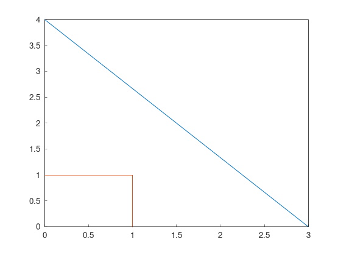

Part 1: Basic types
===================

All the tutorials assume Fields2Cover library and iostream are included as:

.. tabs:: lang

    .. code-tab:: c
        :caption: C++

        #include "fields2cover.h"
        #include <iostream>

    .. code-tab:: python
        :caption: Python

        import fields2cover as f2c

Initialize a F2CPoint
---------------------

Points are the most basic type. There are many ways to initialize a ``F2CPoint`` (``f2c::types::Point``)

1. Using x and y coordinates

  .. tabs:: lang

    .. code-tab:: c
      :caption: C++

      F2CPoint p1 (1.2, 3.4);
      std::cout << "Point 1: " << p1 << std::endl;

    .. code-tab:: python
      :caption: Python

      p1 = f2c.Point(1.2, 3.4)
      print("Point 1: ", p1)

  *Point 1: Point(1.2, 3.4, 0)*

2. Using x, y and z coordinates

  .. tabs:: lang

    .. code-tab:: cpp
      :caption: C++

      F2CPoint p2 (9.8, 7.6, 5.4);
      std::cout << "Point 2: " << p2 << std::endl;

    .. code-tab:: python
      :caption: Python

      p2 = f2c.Point(9.8, 7.6, 5.4);
      print("Point 2: ", p2);

  *Point 2: Point(9.8, 7.6, 5.4)*

3. Using ``OGRPoint`` from GDAL

  .. tabs:: lang

    .. code-tab:: cpp
      :caption: C++

      F2CPoint p3 (OGRPoint(11, 22));
      std::cout << "Point 3: " << p3 << std::endl;

    .. code-tab:: python
      :caption: Python

      from osgeo import ogr
      ogrpoint = ogr.Geometry(ogr.wkbPoint)
      ogrpoint.AddPoint(11, 22)
      p3 = f2c.Point()
      p3.importFromWkt(ogrpoint.ExportToWkt())
      print("Point 3: ", p3)

  *Point 3: Point(11, 22, 0)*

4. Creating an empty ``F2CPoint`` and setting its components using ``setX``/``setY``/``setZ``.
   The components can be also read with ``getX``/``getY``/``getZ``.

  .. tabs:: lang

    .. code-tab:: cpp
      :caption: C++

      F2CPoint p4;
      p4.setX(3.0);
      p4.setZ(-1.0);
      std::cout << "Point 4: " << p4;
      std::cout << ". Its components are: {x: " << p4.getX();
      std::cout << ", y: " << p4.getY();
      std::cout << ", z: " << p4.getZ() << "}\n";

    .. code-tab:: python
      :caption: Python

      p4 = f2c.Point()
      p4.setX(3.0);
      p4.setZ(-1.0);
      print("Point 4: ", p4,
          ". Its components are: {x: ", p4.getX(),
          ", y: ", p4.getY(),
          ", z: ", p4.getZ(), "}")

  *Point 4: Point(3, 0, -1). Its components are: {x: 3, y: 0, z: -1}*

5. Creating an empty ``F2CPoint`` and importing its components.

  .. tabs:: lang

    .. code-tab:: cpp
      :caption: C++

      F2CPoint p5;
      p5.importFromWkt("POINT (0 4 4)");
      std::cout << "Point 5: " << p5 << std::endl;

    .. code-tab:: python
      :caption: Python

      p5 = f2c.Point()
      p5.importFromWkt("POINT (0 4 4)")
      print("Point 5: ", p5)

  *Point 5: Point(0, 4, 4)*

Basic types are shared pointers
-------------------------------

Classes derived from GDAL types, like ``F2CPoint`` from ``OGRPoint``,
use a compound structure of shared pointers on it.

The pointers to GDAL types can be access as ``p1->()`` or ``p1.get()``.
Usually, this is not needed, as a simple access has been provided:

.. tabs:: lang

  .. code-tab:: cpp
    :caption: C++

    std::cout << "Access to OGRPoints: " << p4->Distance(p5.get()) << std::endl;
    std::cout << "Without accessing: " << p4.distance(p5) << std::endl;

  .. code-tab:: python
    :caption: Python

    print("Access to OGRPoints: ", p4->Distance(p5.get()));
    print("Without accessing: ", p4.distance(p5));

| *Access to OGRPoints: 5*
| *Without accessing: 5*

Initialize a F2CLineString
--------------------------

A ``F2CLineString`` (``f2c::types::LineString``) is a line defined by a vector of points. To initialize a ``F2CLineString``, we can:

1. Create an empty ``F2CLineString`` and adding several ``F2CPoint``:

  .. tabs:: lang

    .. code-tab:: cpp
      :caption: C++

      F2CLineString line1;
      line1.addPoint(3, 0);
      line1.addPoint(p5);  // Point(0, 4)
      std::cout << "Length of line 1: " << line1.length() << std::endl;
      
    .. code-tab:: python
      :caption: Python

      line1 = f2c.LineString()
      line1.addPoint(3,0)
      line1.addPoint(p5)
      print("Length of line 1: ", line1.length())

  *Length of line 1: 5*

2. Give a sequence of ``F2CPoint``:

  .. tabs:: lang

    .. code-tab:: cpp
      :caption: C++

      F2CLineString line2({F2CPoint(1, 0), F2CPoint(1, 1), F2CPoint(0, 1)});
      std::cout << "Length of line 2: " << line2.length() << std::endl;
      
    .. code-tab:: python
      :caption: Python

      line2 = f2c.LineString();
      [line2.addPoint(p) for p in [f2c.Point(1, 0), f2c.Point(1, 1), f2c.Point(0, 1)]];
      print("Length of line 2: ", line2.length());
      
  *Length of line 2: 2*

Initialize a F2CLinearRing
--------------------------

A ``F2CLinearRing`` (``f2c::types::LinearRing``) is a closed ``F2CLineString``.
It can be initialized as a ``F2CLineString``:

.. tabs:: lang

  .. code-tab:: cpp
    :caption: C++

    F2CLinearRing ring{F2CPoint(1,1), F2CPoint(1,2), F2CPoint(2,2), F2CPoint(1,1)};
    std::cout << "Area of the ring: " << ring.area() << std::endl;

  .. code-tab:: python
    :caption: Python

    ring = f2c.LinearRing();
    [ring.addPoint(p) for p in [f2c.Point(1,1), f2c.Point(1,2), f2c.Point(2,2), f2c.Point(1,1)]];
    print("Area of the ring: ", ring.area())

*Area of the ring: 0.5*

The main difference between ``F2CLineString`` and ``F2CLinearRing`` is that ``F2CLinearRing`` is expected to be closed, so the area can be computed.

Initializing other collections
------------------------------

A ``F2CMultiLineString`` (``f2c::types::MultiLineString``) are several ``F2CLineString``. It can be initialize as:

.. tabs:: lang

  .. code-tab:: cpp
    :caption: C++

    F2CMultiLineString lines;
    lines.addGeometry(line1);
    lines.addGeometry(line2);

    std::cout << "Lines have length: ";
    for (auto line : lines) {
      std::cout << line.length() << ", ";
    }
    std::cout << std::endl;

  .. code-tab:: python
    :caption: Python

    lines = f2c.MultiLineString();
    lines.addGeometry(line1);
    lines.addGeometry(line2);
    print("Lines have length: ", end="")
    for i in range(lines.size()):
      print(lines.getGeometry(i).length(), end = ", ")
    print("\n")

*Lines have length: 5, 2,*

A ``F2CCell`` (``f2c::types::Cell``) is a polygon created by one outter ``F2CLinearRing`` and zero, one or many inner ``F2CLinearRing``.
The first ``F2CLinearRing`` is the outter one.
Moreover, all the ``F2CLinearRing`` should not intersect with each others.

.. tabs:: lang

  .. code-tab:: cpp
    :caption: C++

    F2CLinearRing outter_ring{
    F2CPoint(0, 0), F2CPoint(2, 0),F2CPoint(2, 2), F2CPoint(0, 2), F2CPoint(0, 0)};
    F2CLinearRing inner_ring{
      F2CPoint(0.5, 0.5), F2CPoint(1.5, 0.5), F2CPoint(1.5, 1.5),
      F2CPoint(0.5, 1.5), F2CPoint(0.5, 0.5)};
    F2CCell cell;
    cell.addRing(outter_ring);
    cell.addRing(inner_ring);
    std::cout << "The area of the cell is: " << cell.area() << std::endl;

  .. code-tab:: python
    :caption: Python

    outter_ring = f2c.LinearRing();
    [outter_ring.addGeometry(p) for p in [  \
      f2c.Point(0, 0), f2c.Point(2, 0), f2c.Point(2, 2), f2c.Point(0, 2), f2c.Point(0, 0)]];
    inner_ring = f2c.LinearRing();
    [inner_ring.addGeometry(p) for p in [  \
      f2c.Point(0.5, 0.5), f2c.Point(1.5, 0.5), f2c.Point(1.5, 1.5),  \
      f2c.Point(0.5, 1.5), f2c.Point(0.5, 0.5)]];
    cell = f2c.Cell();
    cell.addRing(outter_ring);
    cell.addRing(inner_ring);
    print("The area of the cell is: ", cell.area(), "\n");
   

*The area of the cell is: 3*

A ``F2CCells`` (``f2c::types::Cells``) is a multipolygon. It contains zero, one or several ``F2CCell`` on it.

.. tabs:: lang

  .. code-tab:: cpp
    :caption: C++

    F2CCells cells;
    cells.addGeometry(cell);
    std::cout << "The area of the cells is: " << cells.area() << std::endl;

  .. code-tab:: python
    :caption: Python

    cells = f2c.Cells();
    cells.addGeometry(cell);
    print("The area of the cells is: ", cells.area(), "\n\n")
   

*The area of the cells is: 3*

Lastly, ``F2CMultiPoint`` (``f2c::types::MultiPoint``) is a collection of ``F2CPoint``

.. tabs:: lang

  .. code-tab:: cpp
    :caption: C++

    F2CMultiPoint points {F2CPoint(1, 2), F2CPoint(3, 4)};
    std::cout << "Points contains " << points.size() << " points." << std::endl;
    points.addPoint(5, 6);
    std::cout << "Points contains " << points.size() << " points." << std::endl;
    points.addPoint(p5);
    std::cout << "Points contains " << points.size() << " points." << std::endl;

  .. code-tab:: python
    :caption: Python

    points = f2c.MultiPoint();
    [points.addGeometry(p) for p in [f2c.Point(1, 2), f2c.Point(3, 4)]];
    print("Points contains ", points.size(), " points.");
    points.addPoint(5, 6);
    print("Points contains ", points.size(), " points.");
    points.addPoint(p5);
    print("Points contains ", points.size(), " points.");
   

| *Points contains 2 points.*
| *Points contains 3 points.*
| *Points contains 4 points.*

Accessing elements in collections
---------------------------------

To access each of the elements in a collection, the function ``getGeometry(int n)`` returns the element n.

.. tabs:: lang

  .. code-tab:: cpp
    :caption: C++

    F2CPoint p_0 = points.getGeometry(0);
    std::cout << "First point in points: " << p_0 << std::endl;
      
  .. code-tab:: python
    :caption: Python

    p_0 = points.getGeometry(0);
    print("First point in points: ", p_0, "\n")

*First point in points: Point(1, 2, 0)*

Unfortunately, if we change the child element, it is not changed on the collection.
If we want to keep it, we have to set the geometry back with ``setGeometry()``

.. tabs:: lang

  .. code-tab:: cpp
    :caption: C++

    p_0 *= 1e5;
    std::cout << "Modified p_0: " << p_0 << std::endl;
    std::cout << "First point in points without modification: " << points.getGeometry(0) << std::endl;
    points.setGeometry(0, p_0);
    std::cout << "Modified first point in points: " << points.getGeometry(0) << std::endl;

      
  .. code-tab:: python
    :caption: Python

    p_0 *= 1e5;
    print("Modified p_0: ", p_0);
    print("First point in points without modification: ", points.getGeometry(0));
    points.setGeometry(0, p_0);
    print("Modified first point in points: ", points.getGeometry(0));

| *Modified p_0: Point(100000, 200000, 0)*
| *First point in points without modification: Point(1, 2, 0)*
| *Modified first point in points: Point(100000, 200000, 0)*

This process can be done in any of the collection types presented previously:
``F2CLineString``, ``F2CLinearRing``, ``F2CMultiLineString``, ``F2CCell``, ``F2CCells`` and ``F2CMultiPoint``

F2CRobot
---------------------------------

The vehicle to cover the field is defined as a ``F2CRobot`` struct.
To initialize it, the constructor needs the width of the robot and the width of the operation.
For example, if we have a vehicle to fertilize a field, with 3m width and a 39m operational width, we should initialize it as:

.. tabs:: lang

  .. code-tab:: cpp
    :caption: C++

    F2CRobot robot (3.0, 39.0);
      
  .. code-tab:: python
    :caption: Python

    robot = f2c.Robot(3.0, 39.0);

Important functions of ``F2CRobot`` are:

- *getWidth/setWidth*: get/set the width of the robot. If something is closer than this value from the robot, we can expect it will be hit.
- *getCovWidth/setCovWidth*: get/set the coverage width of the robot, also called operational width. This parameter defines the width of the swaths in the field.
- *getMinTurningRadius/setMinTurningRadius* and *getMaxCurv/setMaxCurv*: get/set the minimum turning radius or the maximum curvature, respectively. Both are saved as the same parameter, as maximum curvature is the inverse of the minimum turning radius.
- *getMaxDiffCurv/setMaxDiffCurv*: get/set the maximum linear change of the curvature.

- *getCruiseVel/setCruiseVel*: get/set the speed of the vehicle when traveling through the field.
- *getTurnVel/setTurnVel*: get/set the speed of the vehicle when making turns or going through the headlands.

F2CSwath, F2CSwaths and F2CSwathsByCells
----------------------------------------

A swath, or AB line, is the path that uses an agricultural vehicle to cross the field. On Precision Agriculture, swaths are fixed.
Swaths are coded in the Fields2Cover library as ``F2CSwath``.

A ``F2CSwath`` is defined by a ``F2CLineString``, which defines the path of the swath, and the width of the swath.

``F2CSwaths`` is a collection of ``F2CSwath``. ``F2CSwaths`` groups all the ``F2CSwath`` on a ``F2CCell``.
``F2CSwathsByCells`` collects the ``F2CSwaths`` for each ``F2CCell`` in a ``F2CCells``.

F2CRoute
--------

A ``F2CRoute`` defines a route, as a sequence of ``std::vector<F2CSwaths>`` and ``std::vector<F2CMultiPoint>``.
The order of the sequence is:
- First, follow the first ``F2CMultiPoint``. If it doesn't contain any point, skip it.
- Then, cover the first ``F2CSwaths`` in order, going from the end of each swath to the start of the next one, until all of them are covered.
- Use the next ``F2CMultiPoint`` to go from the end of the last ``F2CSwaths`` covered until the start of the next ``F2CSwaths``, if any. If there is any ``F2CSwaths`` left, the ``F2CMultiPoint`` goes to the end of the route. If ``F2CMultiPoint`` is empty, skip it.
- Follow the last two steps until all ``F2CSwaths`` are covered.

Fortunately, this class handles this behaviour with functions like *addSwaths* and *addConection*, so we do not have to worry about it.

A ``F2CRoute`` is not a path because it doesn't have the turns or the velocities the vehicle needs to follow it.

F2CPath
-------

Lastly, ``F2CPath`` defines a coverage path by a vector of the point, angle, length and velocity of each step. It also provides information about the direction and if it is traversing through the mainland or not.

Visualizing Fields2Cover data
-----------------------------

To visualize Fields2Cover data, the library provides the class ``f2c::Visualizer`` to easily plot our results.

First, we need to create our figure as:

.. tabs:: lang

  .. code-tab:: cpp
    :caption: C++

    f2c::Visualizer::figure();
      
  .. code-tab:: python
    :caption: Python

    f2c.Visualizer.figure();

Then, we can draw our data as:

.. tabs:: lang

  .. code-tab:: cpp
    :caption: C++

    f2c::Visualizer::plot(lines);
      
  .. code-tab:: python
    :caption: Python

    f2c.Visualizer.plot(lines);

   

Finally, the data is plotted as:

.. tabs:: lang

  .. code-tab:: cpp
    :caption: C++

    f2c::Visualizer::show();
      
  .. code-tab:: python
    :caption: Python

    f2c.Visualizer.show();

or saved as:

.. tabs:: lang

  .. code-tab:: cpp
    :caption: C++

    f2c::Visualizer::save("Tutorial_image.png");
      
  .. code-tab:: python
    :caption: Python

    f2c.Visualizer.save("Tutorial_image.png");

.. note::

    Remember to add the extension to your images (.png)

The result should be this image:

