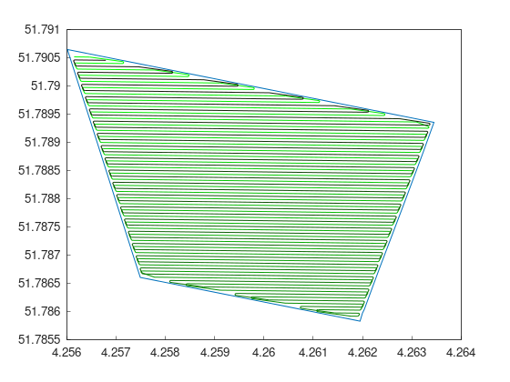

Part 8: Complete flow
=====================

Usually, field shapes are not saved in code as a ``F2CField`` in a local system,
but as a file in a custom Coordinate Reference System (CRS).
Working with them in Fields2Cover is also possible.

For this tutorial, we will assume that the variable ``DATA_PATH`` exists and contains the direction to the data folder.

Import a field
--------------

To import a field from a xml file, we can do:

.. tabs:: lang

  .. code-tab:: cpp
    :caption: C++

    F2CField field = f2c::Parser::importFieldGml(std::string(DATA_PATH) + "test1.xml");

  .. code-tab:: python
    :caption: Python

    field = f2c.Parser().importFieldGml(DATA_PATH + "test1.xml");

``F2CField`` constructor splits the data of the boundary of the field between a ``F2CPoint`` used as a reference point and a ``F2CCells`` with the boundaries in a local space (First point of it is (0, 0)). To obtain the field shape in absolute values, we have the function ``getCellsAbsPosition()``.

Transform to UTM
----------------

In our case, the file "test1.xml" contains data in `EPSG:4258 <https://epsg.io/4258>`_ (European version of GPS). Unfortunately, values are not in a metric system, and the difference between two points are not in meters either. Therefore, working with it is quite difficult.

Luckily, to solve this we can transform this data in its custom CRS into `UTM <https://en.wikipedia.org/wiki/Universal_Transverse_Mercator_coordinate_system>`_.

.. tabs:: lang

  .. code-tab:: cpp
    :caption: C++

    f2c::Transform::transformToUTM(field);

  .. code-tab:: python
    :caption: Python

    f2c.Transform.transformToUTM(field);

This is the only line we need to convert our data to UTM!

.. note::

   The CRS of the data can be obtained from the file or explicitly set by hand. If none was selected, it will try GPS (WGS84 - `EPSG:4326 <https://epsg.io/4326>`_) or ETRS89 - `EPSG:4258 <https://epsg.io/4258>`_).

Create path
-----------

Once we have the field in UTM, let's create a coverage path, as we did it in previous tutorials:

.. tabs:: lang

  .. code-tab:: cpp
    :caption: C++

    F2CRobot robot (2.0, 6.0);
    robot.setMinRadius(2);  // m
    f2c::hg::ConstHL const_hl;
    F2CCells no_hl = const_hl.generateHeadlands(field.getField(), 3.0 * robot.getWidth());
    f2c::sg::BruteForce bf;
    F2CSwaths swaths = bf.generateSwaths(M_PI, robot.getCovWidth(), no_hl.getGeometry(0));
    f2c::rp::SnakeOrder snake_sorter;
    swaths = snake_sorter.genSortedSwaths(swaths);
    f2c::pp::PathPlanning path_planner;
    f2c::pp::DubinsCurves dubins;
    F2CPath path = path_planner.planPath(robot, swaths, dubins);

  .. code-tab:: python
    :caption: Python

    robot = f2c.Robot(2.0, 6.0);
    robot.setMinRadius(2);
    const_hl = f2c.HG_Const_gen()
    no_hl = const_hl.generateHeadlands(field.getField(), 3.0 * robot.getWidth())
    bf = f2c.SG_BruteForce()
    swaths = bf.generateSwaths(math.pi, robot.getCovWidth(), no_hl.getGeometry(0))
    snake_sorter = f2c.RP_Snake()
    swaths = snake_sorter.genSortedSwaths(swaths)
    path_planner = f2c.PP_PathPlanning()
    dubins = f2c.PP_DubinsCurves()
    path = path_planner.planPath(robot, swaths, dubins);

.. image:: ../../figures/Tutorial_8_1_UTM.png

Move the path back to previous CRS
----------------------------------

Our coverage path is now generated in a local system, so we cannot use it like this. To transform the path to the original CRS of the data:

.. tabs:: lang

  .. code-tab:: cpp
    :caption: C++

    F2CPath path_gps = f2c::Transform::transformToPrevCRS(path, field);

  .. code-tab:: python
    :caption: Python

    path_gps = f2c.Transform.transformToPrevCRS(path, field);

Finally, save the path to a file as:

.. tabs:: lang

  .. code-tab:: cpp
    :caption: C++

    path_gps.saveToFile("path.csv");

  .. code-tab:: python
    :caption: Python

    path_gps.saveToFile("path.csv");

