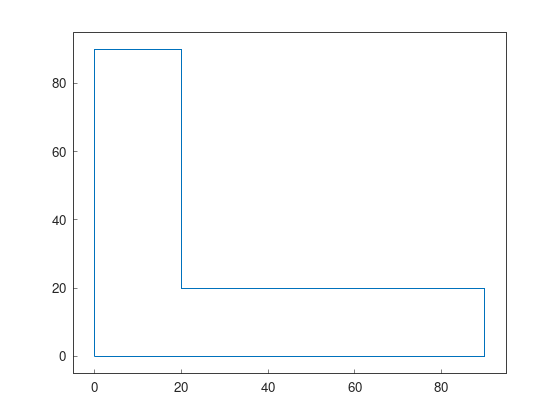
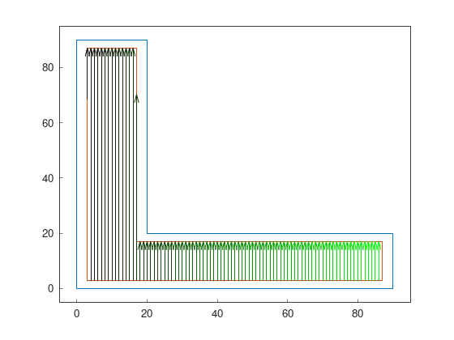
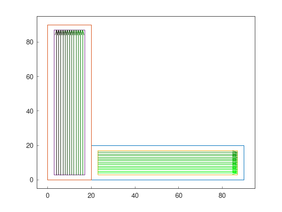

Part 7: Cell Decomposition
==========================

When/Why decompose?
-------------------

Following these tutorials, we have seen that we can cover concave fields with obstacles. Then, it is a valid question to ask why the decomposition process is important for some fields.

We will use a L-shaped field as example.

.. tabs:: lang

  .. code-tab:: cpp
    :caption: C++

    F2CCells cells(F2CCell(F2CLinearRing({
        F2CPoint(  0,  0),
        F2CPoint( 90,  0),
        F2CPoint( 90, 20),
        F2CPoint( 20, 20),
        F2CPoint( 20, 90),
        F2CPoint(  0, 90),
        F2CPoint(  0,  0)})));

  .. code-tab:: python
    :caption: Python

    cells = f2c.Cells(f2c.Cell(f2c.LinearRing(f2c.VectorPoint([
        f2c.Point(  0,  0),
        f2c.Point( 90,  0),
        f2c.Point( 90, 20),
        f2c.Point( 20, 20),
        f2c.Point( 20, 90),
        f2c.Point(  0, 90),
        f2c.Point(  0,  0)]))));

We can be tempted to apply our usual workflow:

.. tabs:: lang

  .. code-tab:: cpp
    :caption: C++

    F2CRobot robot (1.0, 1.0);
    double r_w = robot.getCovWidth();

    f2c::hg::ConstHL const_hl;
    f2c::sg::BruteForce bf;
    f2c::obj::NSwathModified obj;

    F2CCells no_hl_wo_decomp = const_hl.generateHeadlands(cells, 3.0 * r_w);
    F2CSwathsByCells swaths_wo_decomp = bf.generateBestSwaths(obj, r_w, no_hl_wo_decomp);

  .. code-tab:: python
    :caption: Python

    robot = f2c.Robot(1.0, 1.0);
    r_w = robot.getCovWidth();

    const_hl = f2c.HG_Const_gen()
    bf = f2c.SG_BruteForce();
    obj = f2c.OBJ_NSwathModified();

    no_hl_wo_decomp = const_hl.generateHeadlands(cells, 3.0 * r_w);
    swaths_wo_decomp = bf.generateBestSwaths(obj, r_w, no_hl_wo_decomp);

This workflow returns a solution made by 84 swaths.

On the other hand, if we decompose first and then apply the same workflow:

.. tabs:: lang

  .. code-tab:: cpp
    :caption: C++

    f2c::decomp::TrapezoidalDecomp decomp;
    decomp.setSplitAngle(0.5*M_PI);
    F2CCells decomp_cell = decomp.decompose(cells);

    F2CCells no_hl_decomp = const_hl.generateHeadlands(decomp_cell, 3.0 * r_w);
    F2CSwathsByCells swaths_decomp = bf.generateBestSwaths(obj, r_w, no_hl_decomp);

  .. code-tab:: python
    :caption: Python

    decomp = f2c.DECOMP_TrapezoidalDecomp();
    decomp.setSplitAngle(0.5*math.pi);
    decomp_cell = decomp.decompose(cells);

    no_hl_decomp = const_hl.generateHeadlands(decomp_cell, 3.0 * r_w);
    swaths_decomp = bf.generateBestSwaths(obj, r_w, no_hl_decomp);

We get only 26 swaths!! That's a huge improvement. Bigger field would benefit even more of this approach.

Decomposition and Route planner
-------------------------------

The decomposition workflow doesn't work directly with the route planner, because the middle headland ring of each decomposed cell are not connected between them.

To solve this, we use a simple trick. First, we create the middle headland ring with the headland generator. Second, we decompose the inner part of the middle headland ring. Third, we generate the mainland using the headland generator again.

With this process, we make sure that middle headland rings are connected, even after decomposition.

.. tabs:: lang

  .. code-tab:: cpp
    :caption: C++

    F2CCells mid_hl = const_hl.generateHeadlands(cells, 1.5 * r_w);
    F2CCells decomp_mid_hl = decomp.decompose(mid_hl);
    F2CCells no_hl = const_hl.generateHeadlands(decomp_mid_hl, 1.5 * r_w);
    F2CSwathsByCells swaths = bf.generateBestSwaths(obj, r_w, no_hl);

    f2c::rp::RoutePlannerBase route_planner;
    F2CRoute route = route_planner.genRoute(mid_hl, swaths);

  .. code-tab:: python
    :caption: Python

    mid_hl = const_hl.generateHeadlands(cells, 1.5 * r_w);
    decomp_mid_hl = decomp.decompose(mid_hl);
    no_hl = const_hl.generateHeadlands(decomp_mid_hl, 1.5 * r_w);
    swaths = bf.generateBestSwaths(obj, r_w, no_hl);

    route_planner = f2c.RP_RoutePlannerBase();
    route = route_planner.genRoute(mid_hl, swaths);

.. image:: ../../figures/Tutorial_7_2_route.png

