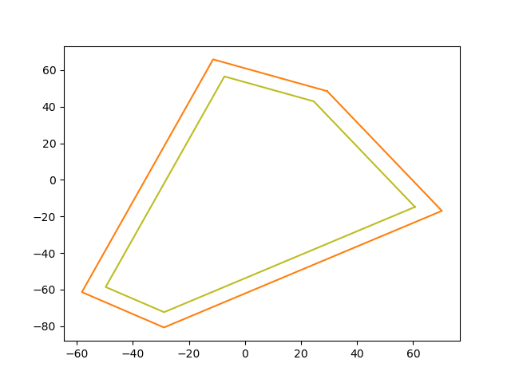

Part 3: Headland generator
==========================

Agricultural vehicles need space to turn between swaths. This area is called a headland.
In Fields2Cover, the headland generator will take a ``F2CCells`` and the width of the headland as input, and it will return another ```F2CCells``` of the same field without the headlands.

Lets create a random field with ``5`` sides and ``1e4`` meters squared of area, and a robot with ``2`` meters of width.

.. tabs:: lang

  .. code-tab:: cpp
    :caption: C++

    f2c::Random rand(42);
    F2CField field = rand.generateRandField(1e4, 5);
    F2CCells cells = field.getField();
    F2CRobot robot (2.0, 26.0);

  .. code-tab:: python
    :caption: Python
    
    rand = f2c.Random(42);
    field = rand.generateRandField(1e4, 5);
    cells = field.getField();
    robot = f2c.Robot(2.0, 26.0);


Constant width headland
-----------------------

This class creates a constant headland around the field.

.. tabs:: lang

  .. code-tab:: cpp
    :caption: C++

    f2c::hg::ConstHL const_hl;
    F2CCells no_hl = const_hl.generateHeadlands(cells, 3.0 * robot.getWidth());
    std::cout << "The complete area is " << cells.area() <<
        ", and the area without headlands is " << no_hl.area() << std::endl;

  .. code-tab:: python
    :caption: Python
    
    const_hl = f2c.HG_Const_gen();
    no_hl = const_hl.generateHeadlands(cells, 3.0 * robot.getWidth());
    print("The complete area is ", cells.area(),
        ", and the area without headlands is ", no_hl.area());

*The complete area is 10000, and the area without headlands is 7676.63*





On orange it is ``cells`` and in green it is ``no_hl``
