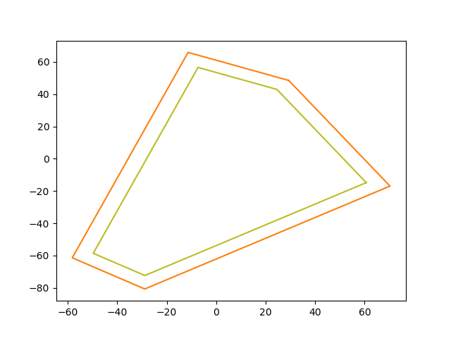
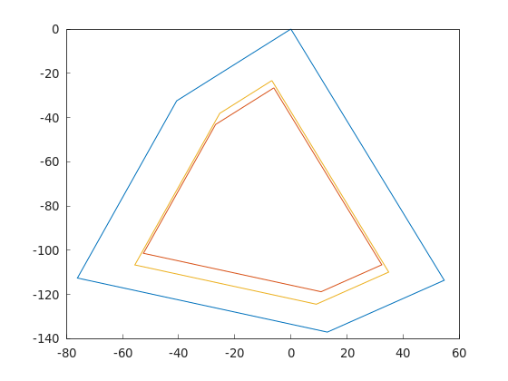

Part 3: Headland generator
==========================

Agricultural vehicles need space to turn between swaths. This area is called a headland.
In Fields2Cover, the headland generator will take a ``F2CCells`` and the width of the headland as input, and it will return another ```F2CCells``` of the same field without the headlands.

Lets create a random field with ``5`` sides and ``1e4`` meters squared of area, and a robot with ``2`` meters of width.

.. tabs:: lang

  .. code-tab:: cpp
    :caption: C++

    f2c::Random rand(42);
    F2CField field = rand.generateRandField(1e4, 5);
    F2CCells cells = field.getField();
    F2CRobot robot (2.0, 26.0);

  .. code-tab:: python
    :caption: Python
    
    rand = f2c.Random(42);
    field = rand.generateRandField(1e4, 5);
    cells = field.getField();
    robot = f2c.Robot(2.0, 26.0);


Constant width headland
-----------------------

This class creates a constant headland around the field.

.. tabs:: lang

  .. code-tab:: cpp
    :caption: C++

    f2c::hg::ConstHL const_hl;
    F2CCells no_hl = const_hl.generateHeadlands(cells, 3.0 * robot.getWidth());
    std::cout << "The complete area is " << cells.area() <<
        ", and the area without headlands is " << no_hl.area() << std::endl;

  .. code-tab:: python
    :caption: Python
    
    const_hl = f2c.HG_Const_gen();
    no_hl = const_hl.generateHeadlands(cells, 3.0 * robot.getWidth());
    print("The complete area is ", cells.area(),
        ", and the area without headlands is ", no_hl.area());

*The complete area is 10000, and the area without headlands is 7676.63*





In blue it is ``cells`` and in orange it is ``no_hl``


Required width headland
-----------------------

A border the swaths run along is only entered, while a border they end on takes a whole turn.
This class asks each border how much room the robot needs on it, given the angle of the swaths, and leaves the rest to the mainland.
It takes the robot and one track angle per cell instead of a width.

.. tabs:: lang

  .. code-tab:: cpp
    :caption: C++

    robot.setMinTurningRadius(8.0);
    f2c::hg::ReqHL req_hl;
    F2CCells req_no_hl = req_hl.generateHeadlands(cells, robot, {0.0});
    F2CCells const_no_hl = const_hl.generateHeadlands(cells, robot, {0.0});
    std::cout << "With swaths at 0 rad, the area without headlands is " <<
        req_no_hl.area() << ", while a constant headland leaves " <<
        const_no_hl.area() << std::endl;

  .. code-tab:: python
    :caption: Python

    robot.setMinTurningRadius(8.0);
    req_hl = f2c.HG_Req_gen();
    req_no_hl = req_hl.generateHeadlands(cells, robot, f2c.VectorDouble([0.0]));
    const_no_hl = const_hl.generateHeadlands(cells, robot, f2c.VectorDouble([0.0]));
    print("With swaths at 0 rad, the area without headlands is ", req_no_hl.area(),
        ", while a constant headland leaves ", const_no_hl.area());

*With swaths at 0 rad, the area without headlands is 4958.6, while a constant headland leaves 4261.26*





In blue it is ``cells``, in orange ``const_no_hl`` and in yellow ``req_no_hl``.
The borders the swaths end on keep the whole headland, so both mainlands meet
there, while the borders they run along give theirs back.
