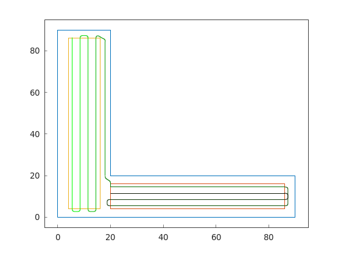
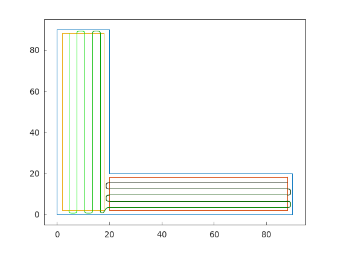
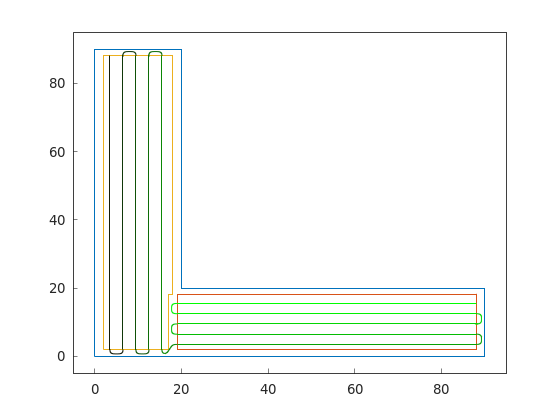

Part 3: Headland generator
==========================

Agricultural vehicles need space to turn between swaths. This area is called a headland.
In Fields2Cover, the headland generator will take a ``F2CCells`` and the width of the headland as input, and it will return another ```F2CCells``` of the same field without the headlands.

Lets create a random field with ``5`` sides and ``1e4`` meters squared of area, and a robot with ``2`` meters of width.

.. tabs:: lang

  .. code-tab:: cpp
    :caption: C++

    f2c::Random rand(42);
    F2CField field = rand.generateRandField(1e4, 5);
    F2CCells cells = field.getField();
    F2CRobot robot (2.0, 26.0);

  .. code-tab:: python
    :caption: Python
    
    rand = f2c.Random(42);
    field = rand.generateRandField(1e4, 5);
    cells = field.getField();
    robot = f2c.Robot(2.0, 26.0);


Constant width headland
-----------------------

This class creates a constant headland around the field.

.. tabs:: lang

  .. code-tab:: cpp
    :caption: C++

    f2c::hg::ConstHL const_hl;
    F2CCells no_hl = const_hl.generateHeadlands(cells, 3.0 * robot.getWidth());
    std::cout << "The complete area is " << cells.area() <<
        ", and the area without headlands is " << no_hl.area() << std::endl;

  .. code-tab:: python
    :caption: Python
    
    const_hl = f2c.HG_Const_gen();
    no_hl = const_hl.generateHeadlands(cells, 3.0 * robot.getWidth());
    print("The complete area is ", cells.area(),
        ", and the area without headlands is ", no_hl.area());

*The complete area is 10000, and the area without headlands is 7676.63*


.. image:: ../../figures/Tutorial_3_1_Const_width.png


In blue it is ``cells`` and in orange it is ``no_hl``


Required width headland
-----------------------

A border the swaths run along is only entered, while a border they end on takes a whole turn.
This class asks each border how much room the robot needs on it, given the angle of the swaths, and leaves the rest to the mainland.
It takes the robot and one track angle per cell instead of a width.

.. tabs:: lang

  .. code-tab:: cpp
    :caption: C++

    robot.setMinTurningRadius(8.0);
    f2c::hg::ReqHL req_hl;
    F2CCells req_no_hl = req_hl.generateHeadlands(cells, robot, {0.0});
    F2CCells const_no_hl = const_hl.generateHeadlands(cells, robot, {0.0});
    std::cout << "With swaths at 0 rad, the area without headlands is " <<
        req_no_hl.area() << ", while a constant headland leaves " <<
        const_no_hl.area() << std::endl;

  .. code-tab:: python
    :caption: Python

    robot.setMinTurningRadius(8.0);
    req_hl = f2c.HG_Req_gen();
    req_no_hl = req_hl.generateHeadlands(cells, robot, f2c.VectorDouble([0.0]));
    const_no_hl = const_hl.generateHeadlands(cells, robot, f2c.VectorDouble([0.0]));
    print("With swaths at 0 rad, the area without headlands is ", req_no_hl.area(),
        ", while a constant headland leaves ", const_no_hl.area());

*With swaths at 0 rad, the area without headlands is 4958.6, while a constant headland leaves 4261.26*


.. image:: ../../figures/Tutorial_3_2_Req_width.png


In blue it is ``cells``, in orange ``const_no_hl`` and in yellow ``req_no_hl``.
The borders the swaths end on keep the whole headland, so both mainlands meet
there, while the borders they run along give theirs back.


Corridor headland
------------------

A non-convex field is usually decomposed into simpler cells before planning a route, and
that decomposition adds a new, artificial border wherever two cells meet.
Widening that border with another ``ConstHL`` pass shrinks both cells, even though
only one machine ever needs to turn there. ``CorridorHL`` opens a single corridor
along that border instead, splitting it between the two cells with a
``CorridorShareMode``: ``ASYMMETRIC`` (the default) takes the whole corridor out
of whichever cell can spare it, and ``SYMMETRIC`` always splits it evenly.

Lets use an L-shaped field, decomposed at the reflex corner into a tall and a wide cell,
and plan a route on each version of the mainland to see the difference in practice.

.. tabs:: lang

  .. code-tab:: cpp
    :caption: C++

    F2CCells l_cells(F2CCell(F2CLinearRing({
          F2CPoint(  0,  0), F2CPoint( 90,  0), F2CPoint( 90, 20),
          F2CPoint( 20, 20), F2CPoint( 20, 90), F2CPoint(  0, 90),
          F2CPoint(  0,  0)})));
    const double hl_width = robot.getWidth();
    const double r_w = robot.getCovWidth();

    F2CCells single_no_hl = const_hl.generateHeadlands(l_cells, hl_width);
    f2c::decomp::TrapezoidalDecomp decomp;
    decomp.setSplitAngle(0.5*M_PI);
    F2CCells decomp_cells = decomp.decompose(single_no_hl);

    f2c::sg::BruteForce bf;
    f2c::obj::NSwathModified obj;
    f2c::rp::RoutePlannerBase route_planner;
    f2c::hg::CorridorHL corridor_hl;
    robot.setMinTurningRadius(2.0);
    f2c::pp::PathPlanning path_planner;
    f2c::pp::DubinsCurvesCC turn;

  .. code-tab:: python
    :caption: Python

    l_cells = f2c.Cells(f2c.Cell(f2c.LinearRing(f2c.VectorPoint([
            f2c.Point(  0,  0), f2c.Point( 90,  0), f2c.Point( 90, 20),
            f2c.Point( 20, 20), f2c.Point( 20, 90), f2c.Point(  0, 90),
            f2c.Point(  0,  0)]))));
    hl_width = robot.getWidth();
    r_w = robot.getCovWidth();

    single_no_hl = const_hl.generateHeadlands(l_cells, hl_width);
    decomp = f2c.DECOMP_TrapezoidalDecomp();
    decomp.setSplitAngle(0.5*math.pi);
    decomp_cells = decomp.decompose(single_no_hl);

    bf = f2c.SG_BruteForce();
    obj = f2c.OBJ_NSwathModified();
    route_planner = f2c.RP_RoutePlannerBase();
    corridor_hl = f2c.HG_Corridor_gen();
    robot.setMinTurningRadius(2.0);
    path_planner = f2c.PP_PathPlanning();
    turn = f2c.PP_DubinsCurvesCC();

Headland every border again, the way a route planner would if it treated the new
internal border like any other, and both cells lose a headland along it:

.. tabs:: lang

  .. code-tab:: cpp
    :caption: C++

    F2CCells double_no_hl = const_hl.generateHeadlands(decomp_cells, hl_width);
    F2CSwathsByCells double_swaths = bf.generateBestSwaths(obj, r_w, double_no_hl);
    F2CRoute double_route = route_planner.genRoute(single_no_hl, double_swaths);
    F2CPath double_path = path_planner.planPath(robot, double_route, turn);
    std::cout << "Double headland leaves " << double_no_hl.area() << std::endl;

  .. code-tab:: python
    :caption: Python

    double_no_hl = const_hl.generateHeadlands(decomp_cells, hl_width);
    double_swaths = bf.generateBestSwaths(obj, r_w, double_no_hl);
    double_route = route_planner.genRoute(single_no_hl, double_swaths);
    double_path = path_planner.planPath(robot, double_route, turn);
    print("Double headland leaves ", double_no_hl.area());

*Double headland leaves 1776*





In blue it is ``l_cells``, in orange ``double_no_hl`` and the path shows where
each swath is and how the robot turns between them. Both the tall and the wide
cell gave up a headland along the border between them, so the area shrank far
more than the outer headland alone would explain.

Hand the same internal border to ``CorridorHL`` instead, in its default
``ASYMMETRIC`` mode:

.. tabs:: lang

  .. code-tab:: cpp
    :caption: C++

    corridor_hl.setShareMode(f2c::hg::CorridorShareMode::ASYMMETRIC);
    F2CCells corridor_no_hl = corridor_hl.generateHeadlands(decomp_cells, hl_width);
    F2CSwathsByCells corridor_swaths =
      bf.generateBestSwaths(obj, r_w, corridor_no_hl);
    F2CRoute corridor_route = route_planner.genRoute(single_no_hl, corridor_swaths);
    F2CPath corridor_path = path_planner.planPath(robot, corridor_route, turn);
    std::cout << "Asymmetric corridor leaves " << corridor_no_hl.area() <<
        std::endl;
    for (auto&& share : corridor_hl.corridorShares(decomp_cells)) {
      std::cout << "Cell " << share.cell_i << " gives " << share.share
        << " of the corridor over " << share.shared_length
        << " m of border with cell " << share.cell_k << std::endl;
    }

  .. code-tab:: python
    :caption: Python

    corridor_hl.setShareMode(f2c.CorridorShareMode_ASYMMETRIC);
    corridor_no_hl = corridor_hl.generateHeadlands(decomp_cells, hl_width);
    corridor_swaths = bf.generateBestSwaths(obj, r_w, corridor_no_hl);
    corridor_route = route_planner.genRoute(single_no_hl, corridor_swaths);
    corridor_path = path_planner.planPath(robot, corridor_route, turn);
    print("Asymmetric corridor leaves ", corridor_no_hl.area());
    for share in corridor_hl.corridorShares(decomp_cells):
      print("Cell", share.cell_i, "gives", share.share,
        "of the corridor over", share.shared_length,
        "m of border with cell", share.cell_k);

*Asymmetric corridor leaves 2464*

*Cell 0 gives 1.0 of the corridor over 16.0 m of border with cell 1*

*Cell 1 gives 0.0 of the corridor over 16.0 m of border with cell 0*





In blue it is ``l_cells`` and in orange ``corridor_no_hl``. Cell 0, the wide
cell, gives up the whole corridor; cell 1, the tall one, keeps its full width
up to the border. ``corridor_no_hl`` ends up close to ``single_no_hl`` again,
instead of the much smaller ``double_no_hl``, because the border only had to
give up its headland once, not twice.

Switch to ``SYMMETRIC`` mode and both cells split the same corridor evenly instead:

.. tabs:: lang

  .. code-tab:: cpp
    :caption: C++

    corridor_hl.setShareMode(f2c::hg::CorridorShareMode::SYMMETRIC);
    F2CCells shared_no_hl = corridor_hl.generateHeadlands(decomp_cells, hl_width);
    F2CSwathsByCells shared_swaths = bf.generateBestSwaths(obj, r_w, shared_no_hl);
    F2CRoute shared_route = route_planner.genRoute(single_no_hl, shared_swaths);
    F2CPath shared_path = path_planner.planPath(robot, shared_route, turn);
    std::cout << "Symmetric shared corridor leaves " << shared_no_hl.area() <<
        std::endl;

  .. code-tab:: python
    :caption: Python

    corridor_hl.setShareMode(f2c.CorridorShareMode_SYMMETRIC);
    shared_no_hl = corridor_hl.generateHeadlands(decomp_cells, hl_width);
    shared_swaths = bf.generateBestSwaths(obj, r_w, shared_no_hl);
    shared_route = route_planner.genRoute(single_no_hl, shared_swaths);
    shared_path = path_planner.planPath(robot, shared_route, turn);
    print("Symmetric shared corridor leaves ", shared_no_hl.area());

*Symmetric shared corridor leaves 2464*





In blue it is ``l_cells`` and in orange ``shared_no_hl``. The total area lost
is exactly the same as with ``ASYMMETRIC``, since the corridor is the same
width either way; only which cell it comes from changes. Here both the tall
and the wide cell give up half the corridor, so the wide cell shrinks a little
on this border instead of the tall cell shrinking a lot.
