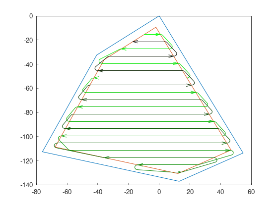
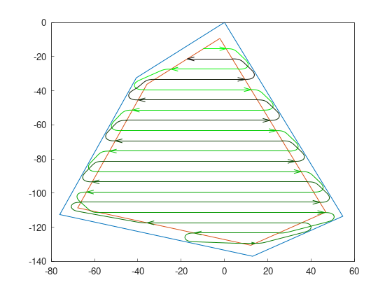
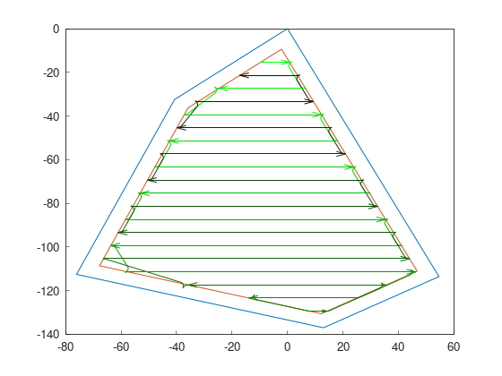
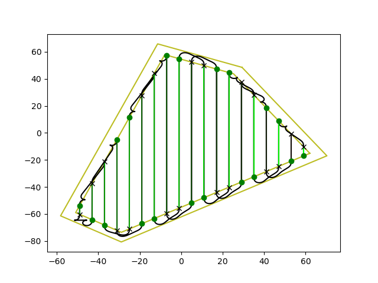

Part 6: Path planning
=======================

Lastly, time to create the final path. A good path planner will do this task.

For these examples, we will continue from the previous tutorial:

.. code-block:: python

  rand = f2c.Random(42)
  robot = f2c.Robot(2.0, 6.0)
  const_hl = f2c.HG_Const_gen()
  field = rand.generateRandField(5, 1e4)
  cells = field.field
  no_hl = const_hl.generateHeadlands(cells, 3.0 * robot.robot_width)
  bf = f2c.SG_BruteForce()
  swaths = bf.generateSwaths(math.pi, robot.op_width, no_hl.getGeometry(0))
  snake_sorter = f2c.RP_Snake()
  swaths = snake_sorter.genSortedSwaths(swaths)

Before continue, we will define the path planner and some parameters that will be needed for computing the turns:

.. code-block:: python

  robot.setMinRadius(2)  # m
  robot.linear_curv_change = 0.1  # 1/m^2
  path_planner = f2c.PP_PathPlanning()

Dubins curves
-------------------------------

Dubins curves are generated with 3 segments of turn. Segments of turn in Dubins are always going forward.
Segment types are straight, right curve or left curve.

Dubins produces the shortest turn possible.

.. code-block:: python

   dubins = f2c.PP_DubinsCurves()
   path_dubins = path_planner.searchBestPath(robot, swaths, dubins);

Dubins curves with Continuous curvature
------------------------------------------

While Dubins curves produces the shortest path possible, going from one segment of the curve to another creates instant curvature change.
A vehicle could not follow a path with this issue, so this path planner implements an integrator to change the curvature smoothly.

.. code-block:: python

   dubins_cc = f2c.PP_DubinsCurvesCC();
   path_dubins_cc = path_planner.searchBestPath(robot, swaths, dubins_cc);

Reeds-Shepp curves
-------------------------------

Reeds-Shepp curves also computes the shortest path, but allowing the vehicle to go backwards.

.. code-block:: python

   reeds_shepp = f2c.PP_ReedsSheppCurves();
   path_reeds_shepp = path_planner.searchBestPath(robot, swaths, reeds_shepp);

Reeds-Shepp curves with Continuous curvature
------------------------------------------------

As with Dubins, instantaneous curvature change is a problem in this kind of curves.
This planner has an integrator to smooth the path.

.. code-block:: python

   reeds_shepp_hc = f2c.PP_ReedsSheppCurvesHC();
   path_reeds_shepp_hc = path_planner.searchBestPath(robot, swaths, reeds_shepp_hc);

