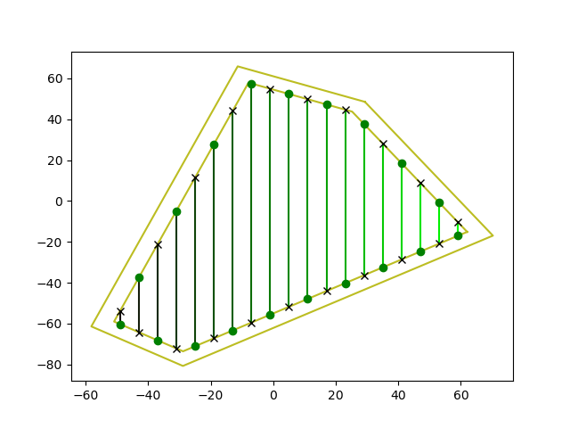
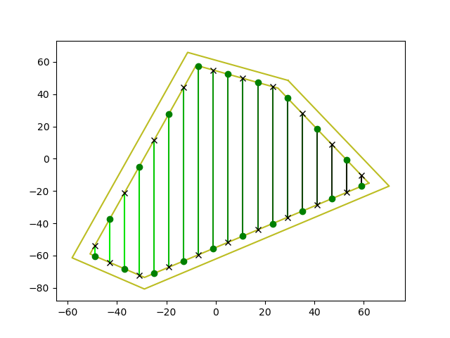
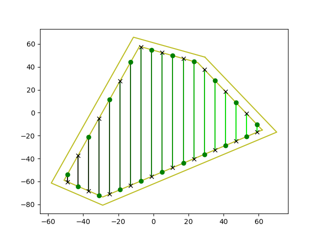
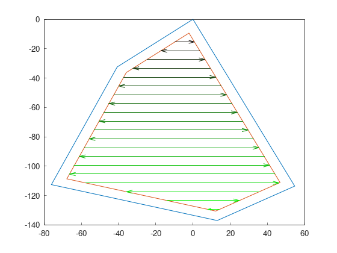
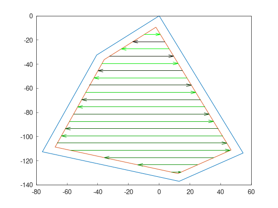
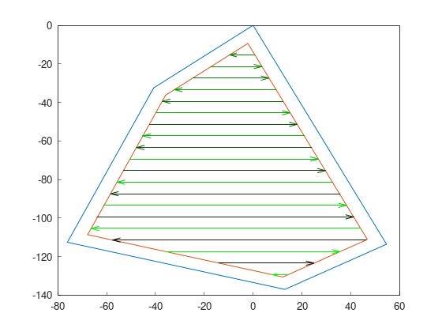

Part 5: Route planning
=========================

.. |snake2| image:: ../../figures/Tutorial_5_2_Snake_2.png
    :scale: 60%

A route planner searches the best order to cover previously generated swaths.
Usually, metaheuristics are used in the search. 

.. note::
  In this version of Fields2Cover, no metaheuristic is provided, only predefined patterns. 
  Route patterns do not return ``F2CRoute``, but ``F2CSwaths`` instead.
  In the next version, route planners will support metaheuristics, ``F2CCells`` as inputs, and ``F2CRoute`` as output.
  

For these examples, we will continue from the previous tutorial:

.. code-block:: cpp

  f2c::Random rand(42);
  F2CRobot robot (2.0, 6.0);
  f2c::hg::ConstHL const_hl;
  F2CCells cells = rand.generateRandField(5, 1e4).field;
  F2CCells no_hl = const_hl.generateHeadlands(cells, 3.0 * robot.robot_width);
  f2c::sg::BruteForce<f2c::obj::NSwath> bf;
  F2CSwaths swaths = bf.generateSwaths(M_PI, robot.op_width, no_hl.getGeometry(0));

Once planned the swaths, it would be awesome to find the best order to cover the field.
To plot the order, we have used green for earlier covered swaths and black for last covered.
The direction of swaths is also green dot to black cross.

.. image:: ../../figures/Tutorial_4_1_Brute_force_Angle.png

Boustrophedon order
-------------------------------

Boustrophedon pattern is one of the most known patterns to cover a field.
Swaths are traveled in the simplest order, covering first the first swath, then the second, and so on.
This pattern can have 4 results on the same field, depending on the start point.

With the next code, swaths are order as the first image.
Calling again ``genSortedSwaths`` produces the other variants.
Once it has been called 4 times, the loop starts over.

.. code-block:: cpp

   f2c::rp::BoustrophedonOrder boustrophedon_sorter(swaths);
   swaths = boustrophedon_sorter.genSortedSwaths();

+------------------+------------------+
| |boustrophedon1| | |boustrophedon2| |
+------------------+------------------+
| |boustrophedon3| | |boustrophedon4| |
+------------------+------------------+

Snake order
-------------------------------

Snake order covers the field skipping one swath each turn, and then coming back using uncovered swaths. This pattern, compared to boustrophedon, reduces the number of sharp turns.

As with boustrophedon pattern, snake pattern also has 4 variants:

.. code-block:: cpp

  f2c::rp::SnakeOrder snake_sorter(swaths);
  swaths = snake_sorter.genSortedSwaths();

+----------+----------+
| |snake1| | |snake2| |
+----------+----------+
| |snake3| | |snake4| |
+----------+----------+
