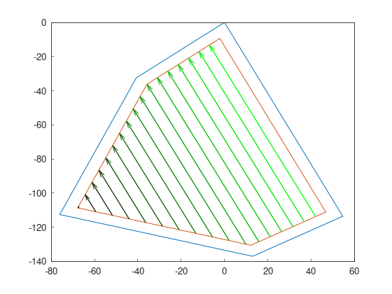
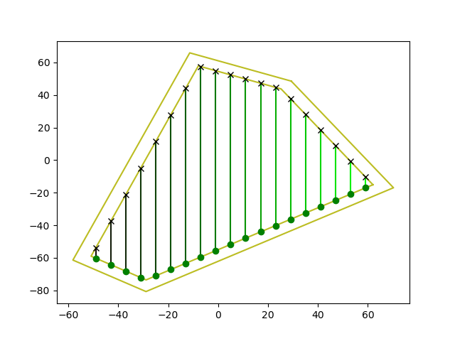

Part 4: Swath generator
===========================

Swath generators plan swaths on the field to be able to cover it completely.
Usually, they have a search method to find the best angle to cover the field.
This algorithms need to define a Global objective function to search the best angle.

For these examples, we will continue from the previous tutorial:

.. code-block:: cpp

  f2c::Random rand(42);
  F2CRobot robot (2.0, 6.0);
  f2c::hg::ConstHL const_hl;
  F2CCells cells = rand.generateRandField(5, 1e4).field;
  F2CCells no_hl = const_hl.generateHeadlands(cells, 3.0 * robot.robot_width);

Brute force
-------------------------------

Brute force algorithm tries all the possible angles (using a step_angle) and keeps the one that produces the smallest cost of the objective function.

Due to the objective function defines the best swaths, changing one objective function for another modifies the output of the algorithm.

This is the output if the global cost function is the number of swaths:

.. code-block:: cpp

  f2c::obj::NSwath n_swath_obj;
  f2c::sg::BruteForce bf_sw_gen_nswath;
  F2CSwaths swaths_bf_nswath = bf_sw_gen_nswath.generateBestSwaths(n_swath_obj, robot.op_width, no_hl.getGeometry(0));

.. image:: ../../figures/Tutorial_4_1_Brute_force_NSwath.png

This is the output if the global cost function is the sum of the length of swaths:

.. code-block:: cpp

  f2c::obj::SwathLength swathlength_obj;
  F2CSwaths swaths_bf_swathlength = bf_sw_gen_swathlength.generateBestSwaths(swathlength_obj, robot.op_width, no_hl.getGeometry(0));

Of course, you can also create swaths with a custom angle:

.. code-block:: cpp

  F2CSwaths swaths_bf_angle = bf_sw_gen_swathlength.generateSwaths(M_PI, robot.op_width, no_hl.getGeometry(0));

